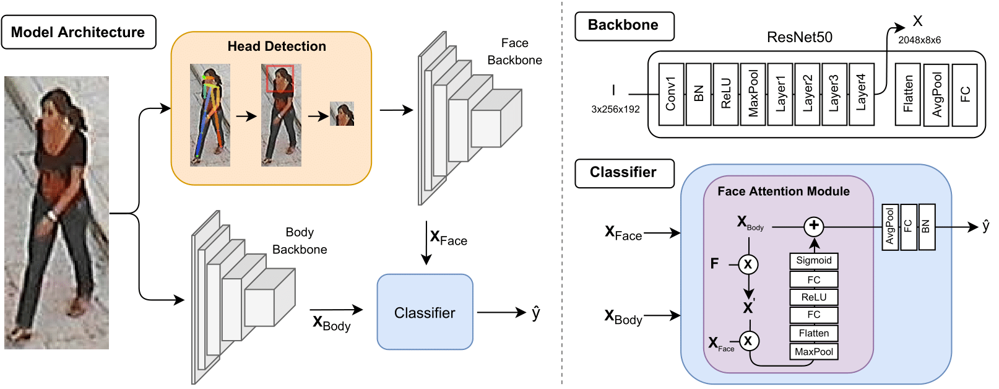
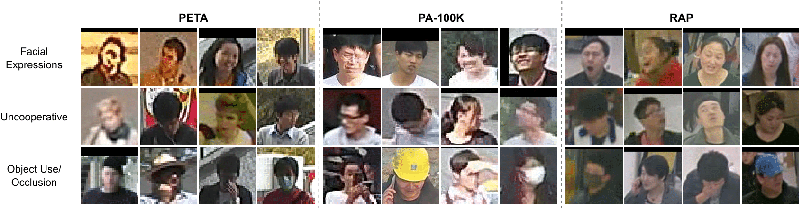

# YinYang-Net: Complementing Face and Body Information for Wild Gender Recognition

This is an official Pytorch implementation of [YinYang-Net: Complementing Face and Body Information for Wild Gender Recognition](https://arxiv.org/abs/2107.06847). The code is released under the [Apache 2.0 license](LICENSE).

## Overall Architecture


Cohesive perspective of the YinYang-Net (YY-Net), divided into three parts: *1) Model Architecture*; *2) Backbone*; and *3) Classifier*. The *Model Architecture* displays our processing flow, where the input data feeds two different backbones: 1) for the body; and 2) for facial information. The facial regions are obtained according our head detection approach, using pose information. The backbones derive from ResNet50, with classifier-related layers ignored, as shown in the *Backbone* portion. The combination of the face and body inputs is done through a classifier, which uses the proposed Face Attention Module to fuse both types of information effectively.

---

## Dependencies

**Prerequisite: Python 3.7.6**

    scipy==1.4.1
    torch==1.4.0
    torchvision==0.5.0
    tqdm==4.43.0
    easydict==1.9
    numpy==1.18.1
    Pillow==7.1.2
    matplotlib

To ease the installation of dependencies we suggest using the `requirements.txt`, via pip:
```
$ pip install -r requirements.txt
```

Optionally, you can create a Python virtual environment and install all the dependencies in it:
```
$ python3 -m venv venv
$ source venv/bin/activate
```

---

## Datasets

In our experiments we use [PETA](http://mmlab.ie.cuhk.edu.hk/projects/PETA.html), [RAP](http://www.rapdataset.com/), and [PA-100K](https://github.com/xh-liu/HydraPlus-Net). All datasets can be downloaded from the original sources or [here](https://github.com/dangweili/pedestrian-attribute-recognition-pytorch). For compatibility purposes with the *.pkl* files provided for dataset reading, we suggest using the latter option. The datasets should be put in `data`, respecting the following tree directory:

```
data
|--PETA
|   |--images
|   |--dataset.pkl
|--RAP
|   |--RAP_dataset
|   |--dataset.pkl
|--PA100k
|   |--data
|   |--dataset.pkl
|--peta_frontal
|   |--dataset.pkl
|--rap_frontal
|   |--dataset.pkl
|--pa100k_frontal
    |--dataset.pkl
```

The frontal version of each dataset contain the *.pkl* of the respective folder. You can download the facial region images [here](https://drive.google.com/drive/folders/1t9xvksiqQnwS2pWyGB-0oLWJbrBvesYT?usp=sharing). Each dataset zip has the folder `face_images`, which should be added to PETA, RAP and PA100k, in `data`.

Alternatively, you can obtain the facial region of these datasets using an **Head Detection approach**, from a previous [work of ours](https://arxiv.org/pdf/2105.05794.pdf). To use it, execute the *head_detection script*:

```
bash head_detection.sh 
```

The Head Detection approach uses JSON files, which we provide in the `data/json` folder. These JSON files contain pose data of PETA, RAP, and PA-100K, obtained via [Alphapose](https://github.com/MVIG-SJTU/AlphaPose). The provided *head_detection script* contains an example of head detection and cropping for PETA. This *script* will create a new directory (`head_detection_output`), outputting images of the cropped head regions. After the *script* finishes its execution, the directory with cropped head regions needs to be renamed to `face_images` and put in the dataset folder, in `data`. 

In the following figure, we display examples of image quality variability, obtained via our head detection approach. These *wild* face datasets contain subjects with varying facial expressions, levels of cooperativeness, and partial occlusions. 



---

## Experiments

To train and infer, we provide two *scripts* with suggestive names. Both contain two variables named `DATASET` and `DATASET_MODEL`. If the aim is to train and evaluate *within-domain*, you only need to change `DATASET` to one of the **six possible names**: PETA, RAP, PA100k, peta_frontal, rap_frontal, or pa100k_frontal. Training parameters are found in `config.py`. As an example, you can train a model by executing the *train script*:
```
bash train.sh 
```

The *infer script* contains an additional variable, `MODEL_CKPTS`, where you should add the path for model's chekpoints.

We provide the [checkpoints](https://drive.google.com/drive/folders/1IuZpF0giTVoXKa6iOrHIqLHWfE5EQSQt?usp=sharing) of our model for the six datasets, in the following table:

| Dataset        | mA    | model       |
|----------------|-------|-------------|
| PETA           | 93.39 | [checkpoints](https://drive.google.com/file/d/13a5eBYIc1CTssmNB3Aibt5lU8g_dO2F1/view?usp=sharing) |
| PETA<sub>Frontal</sub>     | 93.45 | [checkpoints](https://drive.google.com/file/d/1Mh-w6S-Wi1YmJJx8jVYpCBBnJ_bxOY_d/view?usp=sharing) |
| PA-100K        | 91.20 | [checkpoints](https://drive.google.com/file/d/1n7wBwENhinaYX0GBdiiMvXC5iEjGbIRF/view?usp=sharing) |
| PA-100K<sub>Frontal</sub> | 92.79 | [checkpoints](https://drive.google.com/file/d/1ZCGmVS8FzItzZWDQWcK8nTMBht5NYLQ8/view?usp=sharing) |
| RAP            | 96.86 | [checkpoints](https://drive.google.com/file/d/1anF6AetiCRV1jdkoUtbRyBdHdbGR4vNy/view?usp=sharing) |
| RAP<sub>Frontal</sub>    | 97.07 | [checkpoints](https://drive.google.com/file/d/18awC8wn20nF9dGpY2Ba_SwFTwRDVwSKI/view?usp=sharing) |
---

## Citing Paper
If our work or code helped you in your research, please use the following BibTeX entries.

```BibTeX
@article{roxo2021yinyang_net,
  title={YinYang-Net: Complementing Face and Body Information for Wild Gender Recognition},
  author={Roxo, Tiago and Proen{\c{c}}a, Hugo},
  journal={arXiv preprint arXiv:2107.06847},
  year={2021}
}
```

